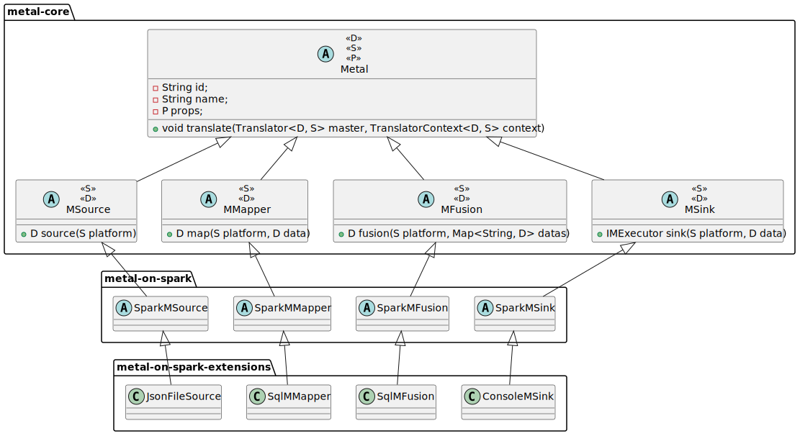
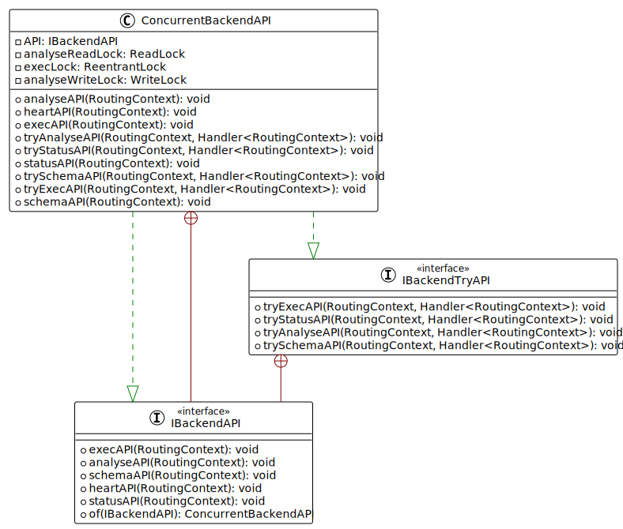
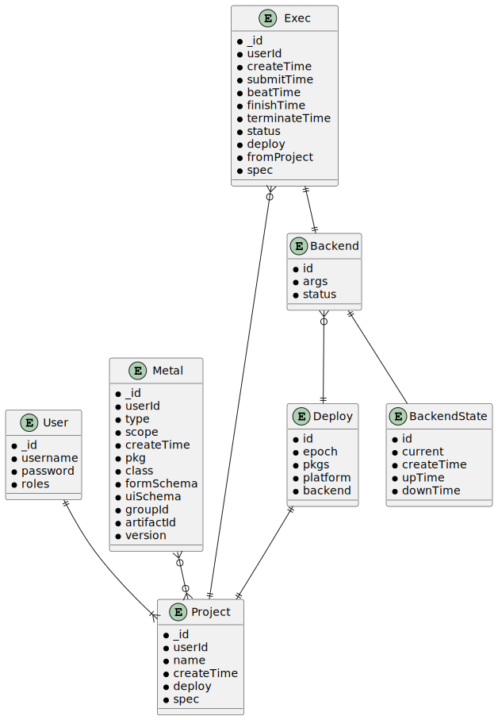
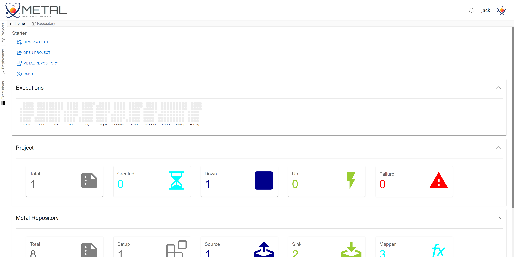
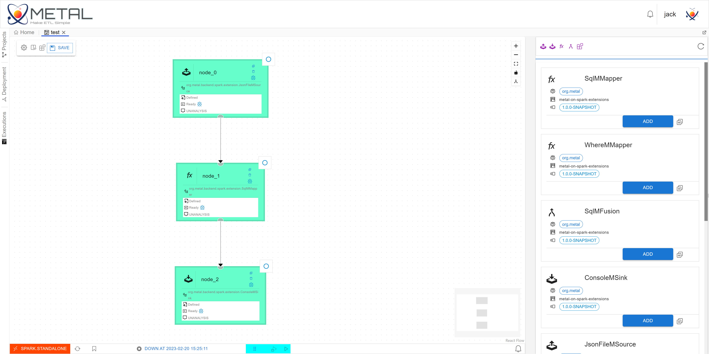
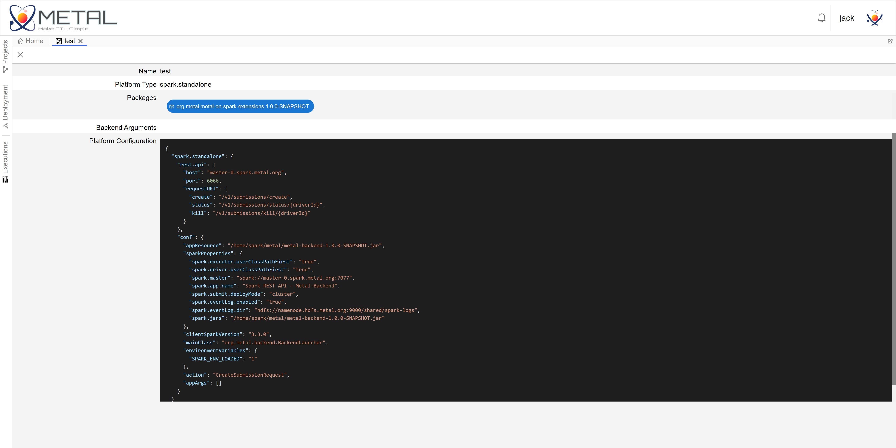
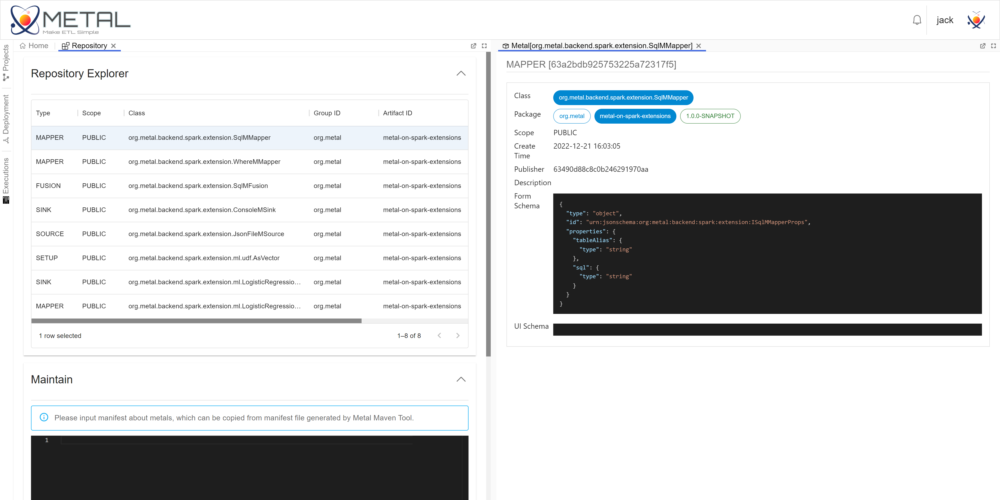

# Architecture


---

[](/doc/Architecture.md) [](/doc/Architecture_cn.md)

---


The Metal project currently consists of the following components,

```shell
.
├── metal-backend
├── metal-backend-api
├── metal-core
├── metal-maven-plugin
├── metal-on-spark
├── metal-on-spark-extensions
├── metal-parent
├── metal-server
├── metal-test
└── metal-ui
```

An overview of each component is as follows,

## metal-core

`metal-core` is the core of Metal, which defines the type of Metal data flow processing operator, data flow analysis inspection and execution.

### Data flow processing operators

#### Types

Metal data flow processing operators include four types, namely Source, Mapper, Fusion, and Sink.



As can be seen from the figure above, the final parent class of all operators/operations is `Metal`, and all subclasses that inherit `Metal` have `id`, `name` and configuration properties `props`. Among them, `props` is used to inject configuration for the operator. Metal abstract operators under `metal-core` are platform-independent. Currently, Metal only supports Spark as the backend execution engine.
In the figure above, `MSource`, `MMapper`, `MFusion` and `MSink` define four basic processing logics of the data stream.

- `MSource`: Used to get data, no data input, output. For example `JsonFileSource` is an implementation of `MSource` on Spark. `JsonFileSource` is used to load JSON-formatted data from a file, returning a DataFrame with a schema.
- `MMapper`: used to process data, has an input, and has an output. For example, `SqlMMapper` is an implementation of `MMapper` on Spark, which allows users to use the input DataFrame as a table, and write SQL to process the input DataFrame to obtain a new DataFrame.
- `MFusion`: Similar to `MMapper`, it is used to process data, but `MFusion` must have two or more inputs. For example `SqlMFusion`, its function is similar to `SqlMMapper`, but must input two or more DataFrames.
- `MSink`: Used to sink data (write to files, message queues, etc.), has one input and no output. For example, `ConsoleMSink` is an implementation of `MSink` on Spark, which can output the input DataFrame on the console, which is often used for debugging.

#### Extension

Metal provides operator extension capabilities. You need to follow the steps below to implement a new `Metal` subclass, and then package and register.

- First, select the operator type according to the number of operator inputs and outputs. For example, if you need to implement a processing operator with one input and one output, then you should choose `MMapper` as the parent class of the operator.
- Then, implement a subclass of `MMapper`. If your operator is the encapsulated Spark SQL processing logic, then you can directly implement the subclass of `SparkMMapper`.
- Finally, you need to configure `metal-maven-plugin` in your project or directly use the `metal-maven-plugin` command line to generate the registration `manifest.json`. Registration is completed by submitting a manifest to Metal.

### Data flow Spec

The data stream processing structure and operator configuration are defined in the data stream Spec. The data flow Spec includes four parts: `version`, `metals`, `edges`, and `waitFor`.

- `version`: The version number of the spec.
- `metals`: A set of Metal is defined, and each Metal definition contains the Metal type, id, name, and other operator configuration information.
- `edges`: Defines a set of data flow directions. Each edge contains the id of the starting and ending Metal. In `eges` you can create a DAG of data streams.
- `waitFor`: A DAG that defines the execution priority of `MSink`.

The following is a simple data flow Spec example,

```json
{
  "version" : "1.0",
  "metals" : [ {
    "type" : "org.metal.backend.spark.extension.JsonFileMSource",
    "id" : "00-00",
    "name" : "source-00",
    "props" : {
      "schema" : "",
      "path" : "src/test/resources/test.json"
    }
  }, {
    "type" : "org.metal.backend.spark.extension.SqlMMapper",
    "id" : "01-00",
    "name" : "mapper-00",
    "props" : {
      "tableAlias" : "source",
      "sql" : "select * from source where id != \"0001\""
    }
  }, {
    "type" : "org.metal.backend.spark.extension.ConsoleMSink",
    "id" : "02-00",
    "name" : "sink-00",
    "props" : {
      "numRows" : 10
    }
  }, {
    "type" : "org.metal.backend.spark.extension.ConsoleMSink",
    "id" : "02-01",
    "name" : "sink-01",
    "props" : {
      "numRows" : 10
    }
  } ],
  "edges" : [ {
    "left" : "00-00",
    "right" : "01-00"
  }, {
    "left" : "01-00",
    "right" : "02-00"
  }, {
    "left" : "00-00",
    "right" : "02-01"
  } ],
  "waitFor" : [ {
    "left" : "02-00",
    "right" : "02-01"
  } ]
}
```



In the example, source-00 will get JSON data from `src/test/resources/test.json`, mapper-00 will take source-00 as input and filter out `id != "0001"` records, sink-00 Print the data filtered by mapper-00 to the console. sink-00 will directly print the data of source-00 to the console. sink-00 will be scheduled for execution before sink-01.

## metal-backend

### interface design

`metal-backend` defines several metal operation interfaces (`analyse`, `schema`, `heart`, `status`, `exec`, etc.), and implements command line mode and interactive mode.

In interactive mode, the `metal-backend` process starts REST services and Vert.x RPCs to communicate with `metal-server`. Regarding these interfaces, some explanations should be made,

- `analyse`: Receive the data stream Spec and check the normativeness. Then build the Spec into a DAG composed of Spark DataFrame. In order to optimize performance, the processing operators that have not changed in the Spec will be reused directly. These changes include changes in operator configuration and input (changes in operator names will not affect reuse).
- `schema`: Get the schema of the operator output DataFrame. Metal is uniformly represented by Arrow Schema.
- `exec`: Execute a DAG built on Spec.
- `heart`: Send a heartbeat.
- `status`: Access service status.

Under the interactive model, `metal-backend` needs to process concurrent requests. Most of the above interface operations can be accessed concurrently, and some can only be accessed serially. heart, can be accessed concurrently, analyze, schema, status and exec need to do concurrency control. The concurrency control relationship is as follows,

|                |     analyse     |     schema      |     status      |        exec         |
|----------------|-----------------|-----------------|-----------------|---------------------|
| [prev] analyse | non-concurrency | non-concurrency | non-concurrency | ==non-concurrency== |
| [prev] schema  | non-concurrency | concurrency     | concurrency     | concurrency         |
| [prev] status  | non-concurrency | concurrency     | concurrency     | concurrency         |
| [prev] exec    | non-concurrency | concurrency     | concurrency     | non-concurrency     |

Line 1, column 4 <analyse, exec> is non-concurrent, which means that when analyze is executed, the exec request will be blocked waiting for execution or a direct method. `metal-backend` defines `IBackendAPI` to achieve this kind of concurrency control, and the specific design diagram is as follows.



The interface defined in `IBackendTryAPI` is a non-blocking interface.

### Operating Mode

#### Cli mode

`metal-backend` implements the command line mode, you can configure the data flow when `spark-submit` submits the task. For example,

```shell
$SPARK_HOME/bin/spark-submit \
	--class org.metal.backend.BackendLauncher \
	--master spark://STANDALONE_MASTER_HOST:PORT \
	--jars $METAL_JARS \
	--conf spark.executor.userClassPathFirst=true \
	--conf spark.driver.userClassPathFirst=true \
	$METAL/metal-backend-1.0-SNAPSHOT.jar \
	--conf appName=Test \
	--cmd-mode \
	--spec-file $METAL_SPEC/spec.json
```

`--cmd-mode` means to open the command line mode. `--spec-file` indicates the URI of the defined data stream Spec, which needs to be accessible by the Spark driver. In addition, you can also use `--spec` to directly configure the content of the embedded Spec on the command line, for example,

```shell
$SPARK_HOME/bin/spark-submit \
	...
	$METAL/metal-backend-1.0-SNAPSHOT.jar \
	...
	--spec "{'version':'1.0', 'metals':[...], 'edges':[...], 'waitFor':[...]}"
```

The Jar file of the operator used in the data flow spec also needs to be specified. You can configure the path of the Jar file in `--jars`.

*Currently, `metal-backend` has only been tested in the Spark Standalone cluster, and Yarn and K8S have not been verified.*

#### interactive mode

`metal-backend` implements the interactive mode. When the interactive mode is enabled, `metal-backend` will start the REST service and the Vert.x RPC service. For example:

```shell
./spark-submit \
	--class org.metal.backend.BackendLauncher \
	--master spark://STANDALONE_MASTER_HOST:PORT \
	--jars $METAL_JAR  \
	--conf spark.executor.userClassPathFirst=true \
	--conf spark.driver.userClassPathFirst=true \
	$METAL/metal-backend-1.0-SNAPSHOT.jar \
	--conf appName=Test \
	--interactive-mode \
	--deploy-id 35c0dbd3-0700-493f-a071-343bc0300bc9 \
	--deploy-epoch 0 \
	--report-service-address report.metal.org \
	--rest-api-port 18000
```

- `--interactive-mode` means to enable interactive mode.
- `--deploy-id` is the deployment id, `--deploy-epoch` is the deployment epoch. The deployment id is used to communicate with `metal-server`, it can be associated with a Project of `metal-server`; the deployment era is designed to provide high availability, when `metal-server` deploys the Backend for the Project, A command similar to the above example will be issued to start a `metal-backend` in interactive mode. In order to prevent the impact of network abnormalities or startup exceptions, the deployment epoch will increase each time the Backend is deployed for the same Project.
- `--report-service-address` is the RPC service address provided by `metal-server` to track the Backend status.
- `--rest-api-port` is the REST API port started by `metal-backend`.

Except for development and debugging, it is almost impossible to manually write interactive mode commands. Under normal circumstances, `metal-server` will automatically deliver the deployment Backend according to your Project configuration.

## metal-server & metal-ui

### metal-server

#### Model



`metal-server` establishes the concept of Project to manage data flow and related configuration. You can select the required Metal operator in Project and define the data flow. `metal-server` will deploy the execution backend according to the configuration, deliver the execution data flow, and track the backend status and data flow execution status.

#### Services

`metal-server` implements Vert.x RPC and REST-API services.
- Report service: used to receive the backend status and task execution status reported by `metal-backend`.
- Failure Detector Service: A detection service that tracks backend failures, and will take offline execution backends with timeouts, process shutdowns, and high delays.
- REST-API service: The service provided for `metal-ui`, including creating Project, configuring Project, saving data flow Spec, deploying backend, executing data flow, and tracking backend status, etc.

### metal-ui

`metal-ui` implements Metal's front-end web UI. You can easily create a project in `metal-ui`, select operator packages, draw data flows, check data flows, submit execution data flows, publish new processing operator packages, manage operator packages, etc.









`metal-ui` is a simple data flow IDE, `metal-ui` will call the REST-API provided by `metal-server` to complete the operation
